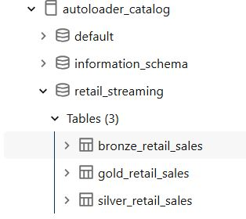
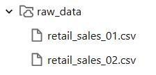
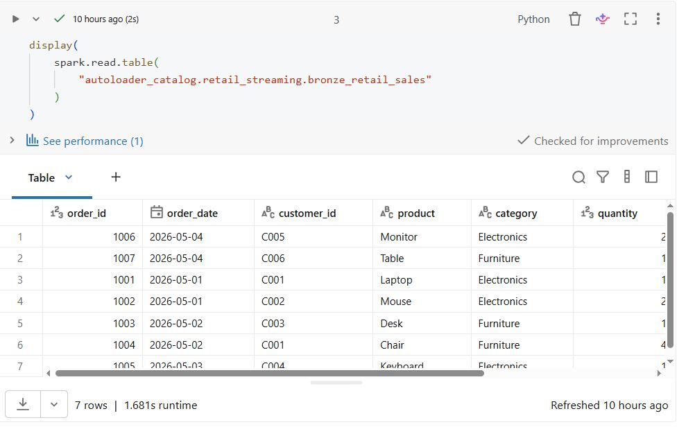
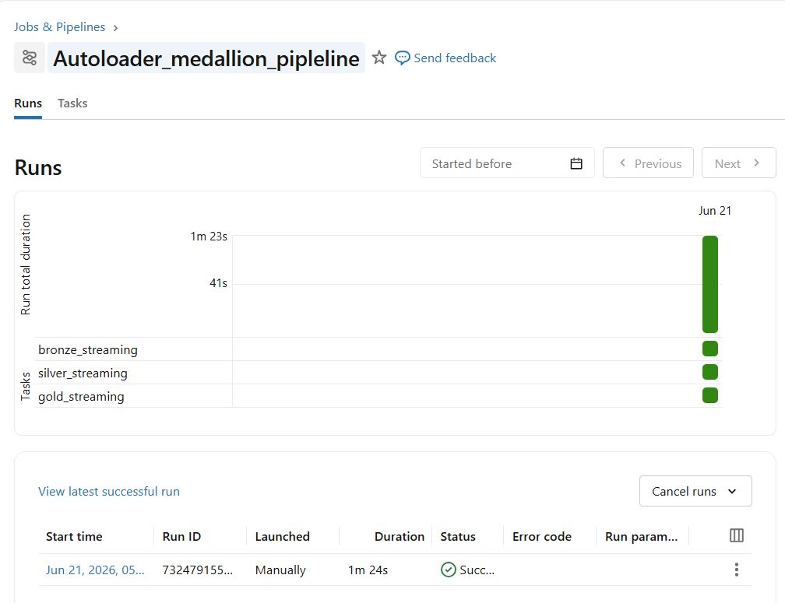
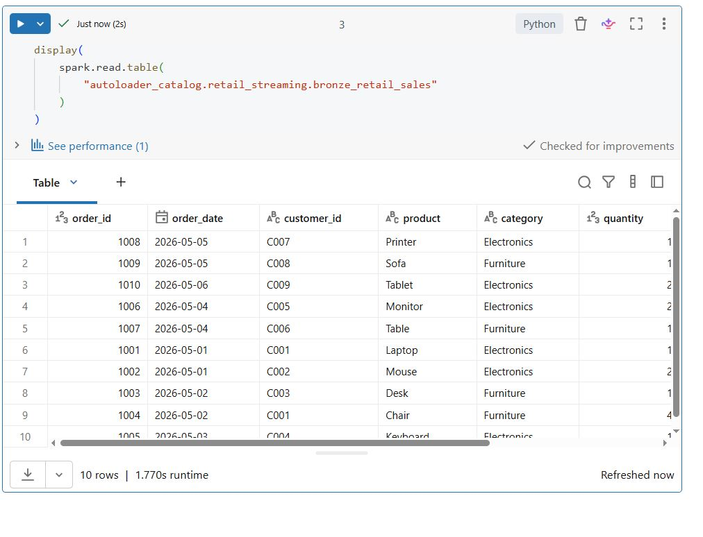
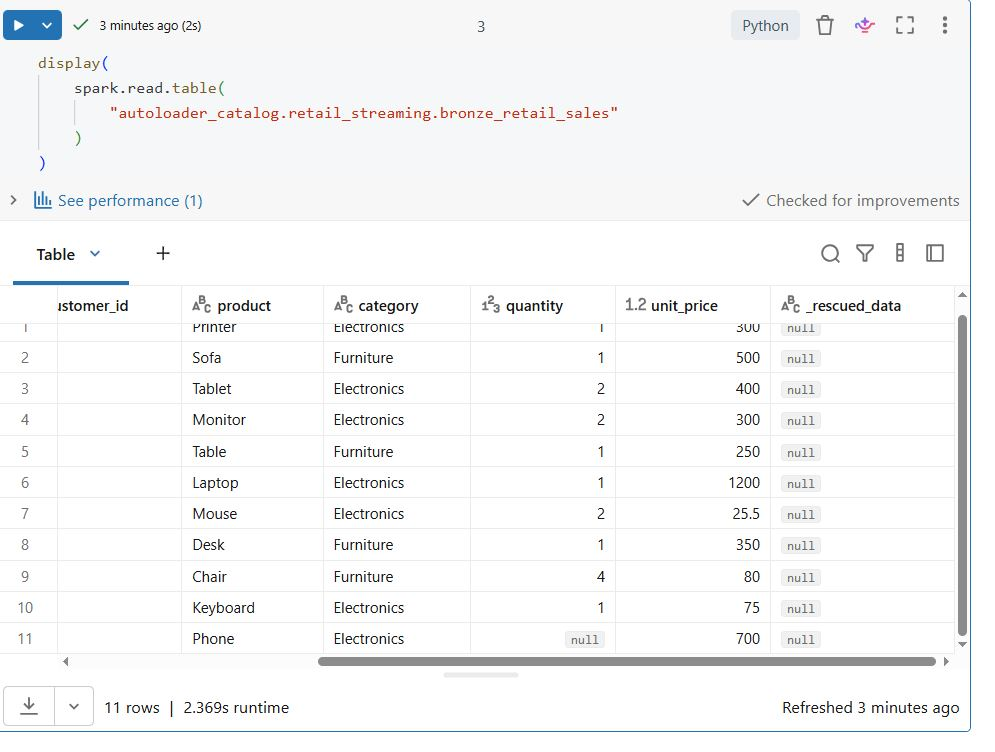

# Databricks Auto Loader Streaming Project

This project implements a retail data pipeline using Databricks Auto Loader, Delta Lake, and Medallion Architecture.

## Architecture

CSV Files → Auto Loader → Bronze Delta Table → Silver Curated Table → Gold Business Aggregations

## Project Objectives

- Implement incremental file ingestion using Databricks Auto Loader
- Build a Medallion Architecture (Bronze, Silver, Gold)
- Process streaming data using Structured Streaming
- Store data in Delta Lake tables
- Implement checkpointing for fault tolerance and exactly-once processing
- Automate pipeline execution using Databricks Workflows

## Technologies

- Databricks
- PySpark
- Auto Loader
- Structured Streaming
- Delta Lake
- GitHub
- GitHub Actions
- Databricks Workflows

## Project Implementation

This project implements an end-to-end Databricks Auto Loader pipeline using Medallion Architecture.

### Pipeline Flow

CSV files → Auto Loader → Bronze Delta Table → Silver Delta Table → Gold Delta Table

### Completed Features

- Created Unity Catalog: `autoloader_catalog`
- Created schema: `retail_streaming`
- Created managed volumes: `raw_data` and `checkpoints`
- Uploaded incremental CSV files: `retail_sales_01.csv` and `retail_sales_02.csv`
- Implemented Bronze Auto Loader ingestion
- Implemented checkpointing and schema tracking
- Created Silver transformation with revenue calculation
- Created Gold aggregation by category
- Orchestrated pipeline using Databricks Workflows

## Project Screenshots

### Catalog and Tables

### Raw Data Volume

### Bronze Table

### Workflow Success

### Incremental Ingestion Test

After adding a new file (`retail_sales_03.csv`) to the source data, Auto Loader automatically detected and processed the new records without reprocessing existing data.

### Data Quality Test

A test file with a missing `quantity` value was ingested. Auto Loader successfully loaded the record into the Bronze table and stored the missing value as `null`, showing that the pipeline can handle incomplete source data without failing.

